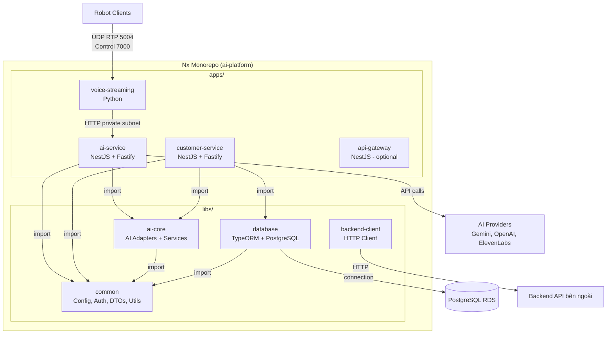
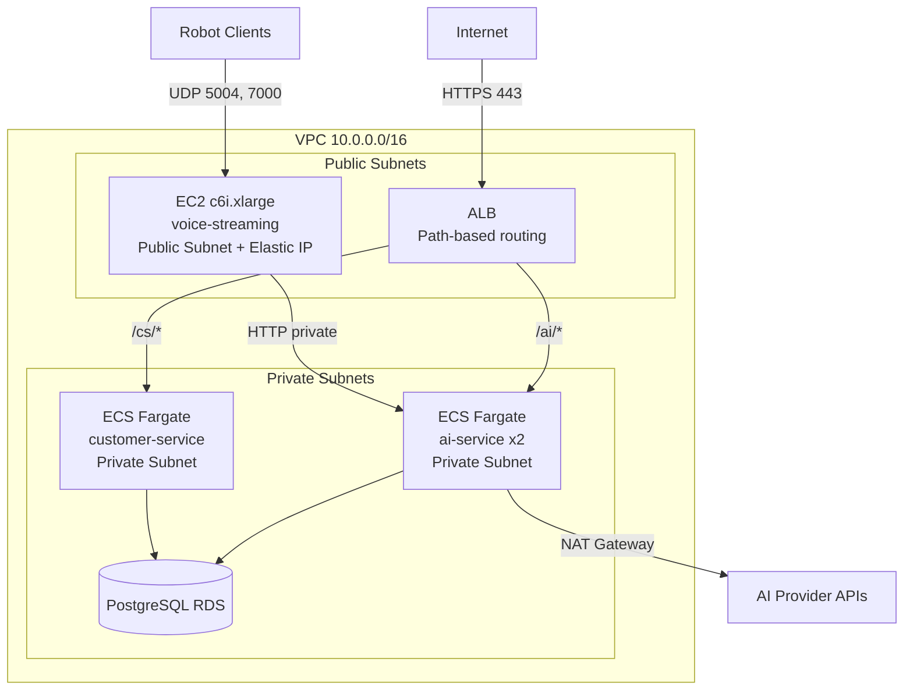
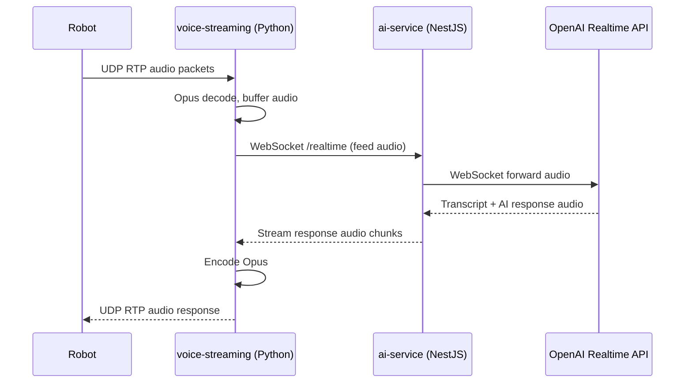
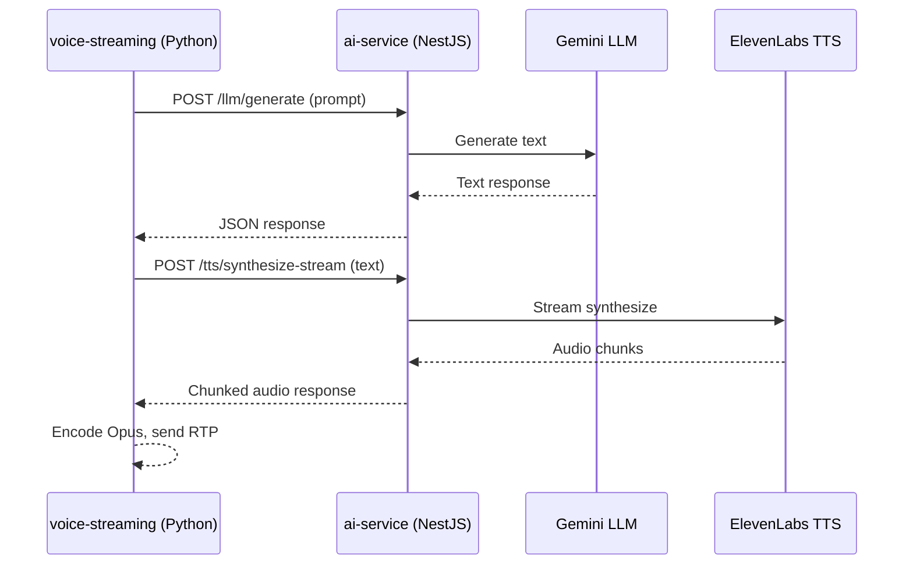
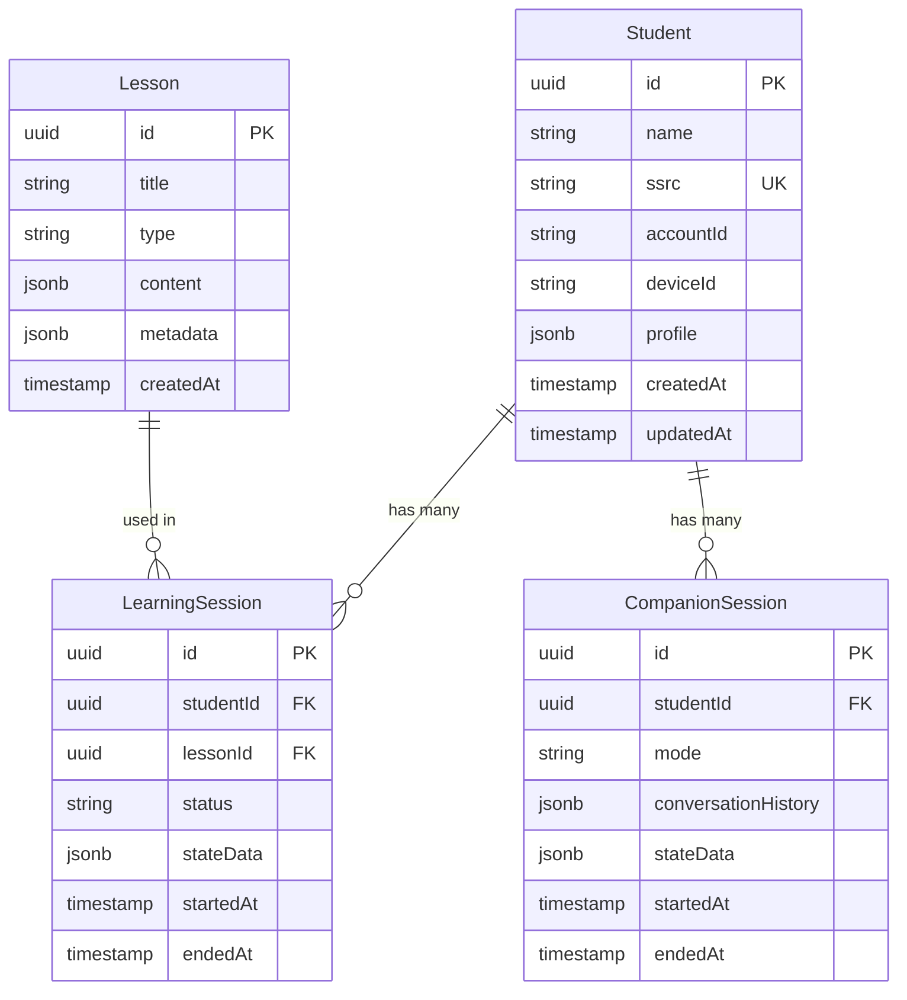

# Tài liệu Thiết kế - AI Platform Monorepo

## Tổng quan

Tài liệu này mô tả thiết kế kỹ thuật cho hệ thống AI Platform Monorepo — một monorepo polyglot sử dụng Nx, chứa cả Python và NestJS apps. Hệ thống tập trung hóa các AI services (LLM, TTS, STT, Realtime) vào thư viện `libs/ai-core`, expose qua NestJS `ai-service` cho Python voice-streaming, và cho phép các NestJS apps khác (customer-service) import trực tiếp in-process.

### Mục tiêu chính

- Tập trung logic AI vào một nơi duy nhất (`libs/ai-core`) để tránh trùng lặp adapter code
- Giữ nguyên Python voice-streaming (đã ổn định), chỉ refactor nhẹ để gọi AI qua HTTP
- Hỗ trợ mở rộng dễ dàng: thêm app mới chỉ cần import `AiCoreModule`
- Triển khai phù hợp từng loại service: EC2 cho voice-streaming (UDP/RTP), ECS Fargate cho NestJS

### Quyết định thiết kế quan trọng

| Quyết định | Lý do |
|------------|-------|
| Nx polyglot monorepo | Hỗ trợ cả NestJS và Python, dependency graph, affected commands, build cache |
| NestJS 10+ với Fastify | Hiệu năng cao hơn Express, NestJS hỗ trợ native |
| TypeORM + PostgreSQL (không Supabase) | Toàn quyền kiểm soát database, repository pattern, migration |
| AiCoreModule Dynamic Module | Cho phép mỗi app cấu hình adapter riêng qua `register()` |
| HTTP nội bộ cho Python ↔ NestJS | Đơn giản, latency thấp (~5-15ms) trong cùng private subnet |
| EC2 cho voice-streaming | Cần UDP port cố định, Elastic IP, stateful sessions |
| ECS Fargate cho NestJS services | Serverless, auto-scaling, zero-downtime deploy |

## Kiến trúc

### Sơ đồ kiến trúc tổng thể



### Sơ đồ triển khai AWS



### Luồng xử lý chính

#### Voice-to-Voice Flow (qua ai-service)



#### Text-to-Voice Flow (qua ai-service)



## Thành phần và Giao diện (Components & Interfaces)

### 3.1. libs/ai-core

#### Abstract Interfaces

```typescript
// interfaces/llm.interface.ts
export interface ILlmAdapter {
  generate(prompt: string, options?: LlmOptions): Promise<string>;
  generateStream(prompt: string, options?: LlmOptions): AsyncIterable<string>;
}

// interfaces/tts.interface.ts
export interface ITtsAdapter {
  synthesize(text: string, options?: TtsOptions): Promise<Buffer>;
  streamSynthesize(text: string, options?: TtsOptions): AsyncIterable<Buffer>;
}

// interfaces/stt.interface.ts
export interface ISttAdapter {
  transcribeAudio(audio: Buffer, options?: SttOptions): Promise<string>;
}

// interfaces/realtime.interface.ts
export interface IRealtimeAdapter {
  connect(sessionConfig: RealtimeSessionConfig): Promise<void>;
  feedAudio(audioChunk: Buffer): void;
  getResponseStream(): AsyncIterable<RealtimeResponse>;
  disconnect(): Promise<void>;
}
```

#### AiCoreModule Dynamic Module

```typescript
// ai-core.module.ts
@Module({})
export class AiCoreModule {
  static register(options: AiCoreOptions): DynamicModule {
    return {
      module: AiCoreModule,
      providers: [
        {
          provide: LLM_ADAPTER,
          useFactory: () => AdapterFactory.createLlm(options.llm),
        },
        {
          provide: TTS_ADAPTER,
          useFactory: () => AdapterFactory.createTts(options.tts),
        },
        {
          provide: STT_ADAPTER,
          useFactory: () => AdapterFactory.createStt(options.stt),
        },
        {
          provide: REALTIME_ADAPTER,
          useFactory: () => AdapterFactory.createRealtime(options.realtime),
        },
        LlmService, TtsService, SttService,
        RealtimeVoiceService, VoiceToVoiceService, TextToVoiceService,
      ],
      exports: [
        LLM_ADAPTER, TTS_ADAPTER, STT_ADAPTER, REALTIME_ADAPTER,
        LlmService, TtsService, SttService,
        RealtimeVoiceService, VoiceToVoiceService, TextToVoiceService,
      ],
    };
  }
}
```

#### AiCoreOptions Interface

```typescript
// interfaces/ai-core-options.interface.ts
export interface AdapterConfig {
  provider: string;
  model: string;
  apiKey: string;
}

export interface AiCoreOptions {
  llm?: AdapterConfig;
  tts?: AdapterConfig;
  stt?: AdapterConfig;
  realtime?: AdapterConfig;
}
```

#### Adapter Factory

```typescript
// adapters/adapter.factory.ts
export class AdapterFactory {
  static createLlm(config: AdapterConfig): ILlmAdapter {
    switch (config.provider) {
      case 'gemini': return new GeminiLlmAdapter(config);
      default: throw new Error(`Unknown LLM provider: ${config.provider}`);
    }
  }
  static createTts(config: AdapterConfig): ITtsAdapter { /* ... */ }
  static createStt(config: AdapterConfig): ISttAdapter { /* ... */ }
  static createRealtime(config: AdapterConfig): IRealtimeAdapter { /* ... */ }
}
```

#### Injection Tokens

```typescript
// constants/injection-tokens.ts
export const LLM_ADAPTER = Symbol('LLM_ADAPTER');
export const TTS_ADAPTER = Symbol('TTS_ADAPTER');
export const STT_ADAPTER = Symbol('STT_ADAPTER');
export const REALTIME_ADAPTER = Symbol('REALTIME_ADAPTER');
```

### 3.2. libs/database

#### DatabaseModule

```typescript
// database.module.ts
@Module({})
export class DatabaseModule {
  static register(options: DatabaseOptions): DynamicModule {
    return {
      module: DatabaseModule,
      imports: [
        TypeOrmModule.forRoot({
          type: 'postgres',
          host: options.host,
          port: options.port,
          username: options.username,
          password: options.password,
          database: options.database,
          entities: [Student, Lesson, LearningSession, CompanionSession],
          synchronize: false, // dùng migrations
        }),
        TypeOrmModule.forFeature([Student, Lesson, LearningSession, CompanionSession]),
      ],
      providers: [
        DatabaseService,
        StudentRepository, LessonRepository,
        LearningSessionRepository, CompanionSessionRepository,
      ],
      exports: [
        DatabaseService,
        StudentRepository, LessonRepository,
        LearningSessionRepository, CompanionSessionRepository,
      ],
    };
  }
}
```

### 3.3. libs/backend-client

```typescript
// backend-client.module.ts
@Module({})
export class BackendClientModule {
  static register(options: { baseUrl: string; timeout?: number }): DynamicModule {
    return {
      module: BackendClientModule,
      providers: [
        { provide: 'BACKEND_OPTIONS', useValue: options },
        BackendClient,
        BackendDeviceClient,
      ],
      exports: [BackendClient, BackendDeviceClient],
    };
  }
}

// backend.client.ts
@Injectable()
export class BackendClient {
  async getAccountAndDeviceInfo(ssrc: string): Promise<AccountDeviceInfo> { /* ... */ }
  async getLessonStatus(lessonId: string): Promise<LessonStatus> { /* ... */ }
}

// backend-device.client.ts
@Injectable()
export class BackendDeviceClient {
  async streamFileFromCache(deviceId: string, fileUrl: string): Promise<void> { /* ... */ }
}
```

### 3.4. libs/common

```typescript
// config/env.config.ts
export const envConfigSchema = Joi.object({
  GEMINI_API_KEY: Joi.string().required(),
  OPENAI_API_KEY: Joi.string().required(),
  ELEVENLABS_API_KEY: Joi.string().required(),
  DB_HOST: Joi.string().required(),
  DB_PORT: Joi.number().default(5432),
  DB_USERNAME: Joi.string().required(),
  DB_PASSWORD: Joi.string().required(),
  DB_DATABASE: Joi.string().required(),
  // ...
});

// auth/auth.guard.ts
@Injectable()
export class SsrcAuthGuard implements CanActivate {
  canActivate(context: ExecutionContext): boolean {
    // Validate SSRC from request against whitelist
  }
}

// utils/json-parser.util.ts
export function parseJsonFromModelOutput(raw: string): Record<string, unknown> { /* ... */ }

// utils/text.util.ts
export function normalizeText(text: string): string { /* ... */ }
export function extractAssistantMessage(output: string): string { /* ... */ }
```

### 3.5. apps/ai-service

```typescript
// llm/llm.controller.ts
@Controller('llm')
export class LlmController {
  constructor(private readonly llmService: LlmService) {}

  @Post('generate')
  async generate(@Body() dto: GenerateDto): Promise<{ result: string }> { /* ... */ }

  @Post('generate-stream')
  @Sse()
  generateStream(@Body() dto: GenerateDto): Observable<MessageEvent> { /* ... */ }
}

// tts/tts.controller.ts
@Controller('tts')
export class TtsController {
  constructor(private readonly ttsService: TtsService) {}

  @Post('synthesize-stream')
  async synthesizeStream(@Body() dto: SynthesizeDto, @Res() res: FastifyReply) {
    // Chunked response with audio data
  }
}

// stt/stt.controller.ts
@Controller('stt')
export class SttController {
  constructor(private readonly sttService: SttService) {}

  @Post('transcribe')
  async transcribe(@Body() audioBuffer: Buffer): Promise<{ text: string }> { /* ... */ }
}

// realtime/realtime.gateway.ts
@WebSocketGateway({ path: '/realtime' })
export class RealtimeGateway {
  // Proxy WebSocket connections to OpenAI Realtime API
  // Session management per client connection
}
```

### 3.6. apps/voice-streaming (Python ai_client)

```python
# ai_client/ai_service_client.py
class AiServiceClient:
    """Base HTTP client với retry, circuit breaker, timeout."""
    def __init__(self, base_url: str, timeout: float = 10.0):
        self.base_url = base_url
        self.session: aiohttp.ClientSession = None
        self.circuit_breaker = CircuitBreaker(failure_threshold=5, recovery_timeout=30)

# ai_client/llm_client.py
class LlmClient(AiServiceClient):
    async def generate(self, prompt: str, options: dict = None) -> str: ...
    async def generate_stream(self, prompt: str, options: dict = None) -> AsyncIterator[str]: ...

# ai_client/tts_client.py
class TtsClient(AiServiceClient):
    async def stream_synthesize(self, text: str, options: dict = None) -> AsyncIterator[bytes]: ...

# ai_client/realtime_client.py
class RealtimeClient:
    """WebSocket client proxy tới ai-service /realtime."""
    async def connect(self, session_config: dict) -> None: ...
    async def feed_audio(self, audio_chunk: bytes) -> None: ...
    async def get_response_stream(self) -> AsyncIterator[dict]: ...
    async def disconnect(self) -> None: ...
```

## Mô hình Dữ liệu (Data Models)

### Entity Diagram



### TypeORM Entities

```typescript
// entities/student.entity.ts
@Entity('students')
export class Student {
  @PrimaryGeneratedColumn('uuid') id: string;
  @Column() name: string;
  @Column({ unique: true }) ssrc: string;
  @Column() accountId: string;
  @Column() deviceId: string;
  @Column({ type: 'jsonb', nullable: true }) profile: Record<string, unknown>;
  @CreateDateColumn() createdAt: Date;
  @UpdateDateColumn() updatedAt: Date;

  @OneToMany(() => LearningSession, (s) => s.student) learningSessions: LearningSession[];
  @OneToMany(() => CompanionSession, (s) => s.student) companionSessions: CompanionSession[];
}

// entities/lesson.entity.ts
@Entity('lessons')
export class Lesson {
  @PrimaryGeneratedColumn('uuid') id: string;
  @Column() title: string;
  @Column() type: string;
  @Column({ type: 'jsonb' }) content: Record<string, unknown>;
  @Column({ type: 'jsonb', nullable: true }) metadata: Record<string, unknown>;
  @CreateDateColumn() createdAt: Date;

  @OneToMany(() => LearningSession, (s) => s.lesson) learningSessions: LearningSession[];
}

// entities/learning-session.entity.ts
@Entity('learning_sessions')
export class LearningSession {
  @PrimaryGeneratedColumn('uuid') id: string;
  @ManyToOne(() => Student, (s) => s.learningSessions) student: Student;
  @Column() studentId: string;
  @ManyToOne(() => Lesson, (l) => l.learningSessions) lesson: Lesson;
  @Column() lessonId: string;
  @Column({ default: 'active' }) status: string;
  @Column({ type: 'jsonb', nullable: true }) stateData: Record<string, unknown>;
  @CreateDateColumn() startedAt: Date;
  @Column({ type: 'timestamp', nullable: true }) endedAt: Date;
}

// entities/companion-session.entity.ts
@Entity('companion_sessions')
export class CompanionSession {
  @PrimaryGeneratedColumn('uuid') id: string;
  @ManyToOne(() => Student, (s) => s.companionSessions) student: Student;
  @Column() studentId: string;
  @Column() mode: string;
  @Column({ type: 'jsonb', nullable: true }) conversationHistory: Record<string, unknown>[];
  @Column({ type: 'jsonb', nullable: true }) stateData: Record<string, unknown>;
  @CreateDateColumn() startedAt: Date;
  @Column({ type: 'timestamp', nullable: true }) endedAt: Date;
}
```

### DTOs

```typescript
// dto/student-profile.dto.ts
export class StudentProfileDto {
  @IsString() @IsNotEmpty() name: string;
  @IsString() @IsNotEmpty() ssrc: string;
  @IsString() @IsNotEmpty() accountId: string;
  @IsString() @IsNotEmpty() deviceId: string;
  @IsOptional() @IsObject() profile?: Record<string, unknown>;
}

// dto/lesson.dto.ts
export class LessonDto {
  @IsString() @IsNotEmpty() title: string;
  @IsString() @IsNotEmpty() type: string;
  @IsObject() content: Record<string, unknown>;
  @IsOptional() @IsObject() metadata?: Record<string, unknown>;
}

// dto/session.dto.ts
export class SessionDto {
  @IsUUID() studentId: string;
  @IsOptional() @IsUUID() lessonId?: string;
  @IsOptional() @IsString() mode?: string;
}
```

### AI Service Request/Response DTOs

```typescript
// ai-service DTOs
export class GenerateDto {
  @IsString() @IsNotEmpty() prompt: string;
  @IsOptional() @IsObject() options?: Record<string, unknown>;
}

export class SynthesizeDto {
  @IsString() @IsNotEmpty() text: string;
  @IsOptional() @IsString() voiceId?: string;
  @IsOptional() @IsObject() options?: Record<string, unknown>;
}

export class TranscribeDto {
  // Audio bytes sent as binary body
}
```


## Correctness Properties

*Một property (thuộc tính đúng đắn) là một đặc tính hoặc hành vi phải luôn đúng trong mọi lần thực thi hợp lệ của hệ thống — về bản chất là một phát biểu hình thức về những gì hệ thống phải làm. Properties đóng vai trò cầu nối giữa đặc tả dễ đọc cho con người và đảm bảo tính đúng đắn có thể kiểm chứng bằng máy.*

### Property 1: Config validation phát hiện đúng biến môi trường hợp lệ và không hợp lệ

*For any* tập hợp biến môi trường, nếu tất cả biến bắt buộc có mặt và đúng định dạng thì config loader phải trả về config object hợp lệ; nếu bất kỳ biến bắt buộc nào bị thiếu hoặc sai định dạng thì config loader phải throw lỗi có chứa tên biến bị lỗi.

**Validates: Requirements 2.1, 2.2**

### Property 2: AuthGuard SSRC whitelist cho phép/từ chối đúng

*For any* giá trị SSRC, nếu SSRC nằm trong whitelist thì AuthGuard phải cho phép request đi qua, nếu SSRC không nằm trong whitelist thì AuthGuard phải từ chối request.

**Validates: Requirements 2.3**

### Property 3: DTO validation chấp nhận dữ liệu hợp lệ và từ chối dữ liệu không hợp lệ

*For any* object dữ liệu, nếu object thỏa mãn tất cả validation constraints của DTO (required fields có mặt, đúng kiểu) thì validation phải pass; nếu bất kỳ constraint nào bị vi phạm thì validation phải fail với thông báo lỗi tương ứng.

**Validates: Requirements 2.4**

### Property 4: JSON parser round-trip từ model output

*For any* chuỗi JSON hợp lệ được nhúng trong model output text, hàm parseJsonFromModelOutput phải trích xuất và parse ra object tương đương với JSON gốc.

**Validates: Requirements 2.5**

### Property 5: Text normalization là idempotent

*For any* chuỗi text, áp dụng normalizeText hai lần liên tiếp phải cho kết quả giống hệt áp dụng một lần: `normalizeText(normalizeText(text)) === normalizeText(text)`.

**Validates: Requirements 2.5**

### Property 6: AdapterFactory tạo đúng adapter theo provider name

*For any* provider name hợp lệ (gemini, elevenlabs, openai) và loại adapter (LLM, TTS, STT, Realtime), AdapterFactory phải trả về instance đúng kiểu adapter tương ứng. *For any* provider name không hợp lệ, AdapterFactory phải throw error.

**Validates: Requirements 3.4**

### Property 7: AiCoreModule.register() tạo DynamicModule với đầy đủ providers

*For any* AiCoreOptions hợp lệ chứa cấu hình cho ít nhất một adapter, AiCoreModule.register() phải trả về DynamicModule có chứa providers và exports tương ứng với các adapter được cấu hình.

**Validates: Requirements 3.3**

### Property 8: Adapter error chứa đầy đủ thông tin lỗi

*For any* adapter (LLM, TTS, STT, Realtime) khi AI provider API trả về lỗi, exception được throw phải chứa: mã lỗi (error code), thông điệp mô tả (message), và tên provider gây lỗi (provider name).

**Validates: Requirements 3.7**

### Property 9: Database CRUD round-trip

*For any* entity hợp lệ (Student, Lesson, LearningSession, CompanionSession), sau khi create entity vào database rồi read lại bằng ID, dữ liệu trả về phải tương đương với dữ liệu đã tạo.

**Validates: Requirements 4.3**

### Property 10: Database connection error mô tả rõ nguyên nhân

*For any* loại lỗi kết nối PostgreSQL (host sai, credentials không hợp lệ, timeout), exception được throw phải chứa thông tin mô tả nguyên nhân lỗi cụ thể.

**Validates: Requirements 4.4**

### Property 11: Backend client HTTP error chứa status code và response body

*For any* HTTP error response (status code 400-599) từ backend API, exception được throw bởi BackendClient phải chứa HTTP status code và response body gốc.

**Validates: Requirements 5.4**

### Property 12: AI Service endpoint contract — valid input trả về valid response

*For any* request hợp lệ tới các endpoint của AI_Service (POST /llm/generate, POST /tts/synthesize-stream, POST /stt/transcribe), response phải có HTTP status 200 và body chứa dữ liệu đúng định dạng (text cho LLM/STT, audio bytes cho TTS).

**Validates: Requirements 6.1, 6.2, 6.3, 6.4**

### Property 13: AI Service validation — missing required fields trả về HTTP 400

*For any* endpoint của AI_Service và *for any* tổ hợp thiếu trường bắt buộc trong request body, response phải có HTTP status 400 và body chứa thông báo validation error đề cập đến trường bị thiếu.

**Validates: Requirements 6.9**

### Property 14: Python ai_client retry với exponential backoff và circuit breaker

*For any* chuỗi N lần gọi thất bại liên tiếp (N < failure_threshold), ai_client phải retry với khoảng cách tăng dần (exponential backoff). Khi số lần thất bại đạt failure_threshold, circuit breaker phải mở và các request tiếp theo phải bị từ chối ngay lập tức mà không gọi HTTP.

**Validates: Requirements 7.6**

### Property 15: NestJS structured logs là valid JSON

*For any* log event được ghi bởi NestJS app, output phải là chuỗi JSON hợp lệ có thể parse được.

**Validates: Requirements 11.1**

## Xử lý Lỗi (Error Handling)

### Chiến lược xử lý lỗi theo tầng

| Tầng | Loại lỗi | Xử lý |
|------|----------|-------|
| **libs/common** | Config validation error | Throw lỗi khi khởi động app, mô tả rõ biến thiếu/sai. App không start nếu config invalid |
| **libs/ai-core** | AI provider API error | Adapter throw exception chứa error code, message, provider name. Service layer có thể retry hoặc fallback |
| **libs/ai-core** | Invalid provider name | AdapterFactory throw error ngay khi register() |
| **libs/database** | Connection failure | Throw lỗi mô tả nguyên nhân. App có thể retry connection với backoff |
| **libs/database** | Query error | Repository throw TypeORM exception, service layer xử lý |
| **libs/backend-client** | HTTP 4xx/5xx | Throw exception chứa status code và response body |
| **libs/backend-client** | Timeout | Throw timeout exception sau khoảng thời gian cấu hình |
| **apps/ai-service** | Validation error | Trả HTTP 400 với thông báo cụ thể về trường thiếu/sai |
| **apps/ai-service** | Internal error | Trả HTTP 500, log chi tiết lỗi, không expose internal details |
| **apps/voice-streaming** | ai-service unavailable | Retry với exponential backoff, circuit breaker mở sau N failures |
| **apps/voice-streaming** | ai-service timeout | Timeout exception, retry hoặc fallback tùy context |

### Circuit Breaker Pattern (Python ai_client)

```
States:
  CLOSED (bình thường) → gọi HTTP bình thường
  OPEN (ngắt mạch)    → reject ngay, không gọi HTTP
  HALF_OPEN (thử lại) → cho 1 request thử, nếu thành công → CLOSED, nếu thất bại → OPEN

Config:
  failure_threshold: 5 lần thất bại liên tiếp → OPEN
  recovery_timeout: 30 giây → chuyển sang HALF_OPEN
  backoff: exponential (1s, 2s, 4s, 8s, 16s)
```

### NestJS Global Exception Filter

```typescript
@Catch()
export class GlobalExceptionFilter implements ExceptionFilter {
  catch(exception: unknown, host: ArgumentsHost) {
    // Log structured error
    // Map to appropriate HTTP response
    // Không expose internal stack traces
  }
}
```

## Chiến lược Kiểm thử (Testing Strategy)

### Phương pháp kiểm thử kép

Hệ thống sử dụng kết hợp hai phương pháp kiểm thử bổ sung cho nhau:

1. **Unit tests**: Kiểm tra các ví dụ cụ thể, edge cases, và điều kiện lỗi
2. **Property-based tests**: Kiểm tra các thuộc tính phổ quát trên mọi input

Cả hai đều cần thiết để đạt coverage toàn diện — unit tests bắt lỗi cụ thể, property tests xác minh tính đúng đắn tổng quát.

### Thư viện Property-Based Testing

- **NestJS/TypeScript**: Sử dụng [fast-check](https://github.com/dubzzz/fast-check) — thư viện PBT phổ biến nhất cho TypeScript
- **Python**: Sử dụng [Hypothesis](https://hypothesis.readthedocs.io/) — thư viện PBT chuẩn cho Python
- Mỗi property test phải chạy tối thiểu **100 iterations**
- Mỗi property test phải có comment tag tham chiếu đến property trong design document

### Tag Format

```
// Feature: ai-platform-monorepo, Property {number}: {property_text}
```

### Phân bổ kiểm thử theo component

#### libs/common
- **Unit tests**: Ví dụ cụ thể cho config loader, AuthGuard, DTOs, utils
- **Property tests**:
  - Property 1: Config validation (fast-check: arbitrary env var sets)
  - Property 2: AuthGuard SSRC whitelist (fast-check: arbitrary SSRC strings)
  - Property 3: DTO validation (fast-check: arbitrary objects)
  - Property 4: JSON parser round-trip (fast-check: arbitrary JSON objects)
  - Property 5: Text normalization idempotence (fast-check: arbitrary strings)

#### libs/ai-core
- **Unit tests**: Mock AI provider responses, test adapter behavior cụ thể
- **Property tests**:
  - Property 6: AdapterFactory correctness (fast-check: arbitrary provider names)
  - Property 7: AiCoreModule.register() (fast-check: arbitrary AiCoreOptions)
  - Property 8: Adapter error info (fast-check: arbitrary error responses)

#### libs/database
- **Unit tests**: CRUD operations với dữ liệu cụ thể, edge cases
- **Property tests**:
  - Property 9: CRUD round-trip (fast-check: arbitrary entity data, cần test DB)
  - Property 10: Connection error descriptions (fast-check: arbitrary connection configs)

#### libs/backend-client
- **Unit tests**: Mock HTTP responses, test error handling cụ thể
- **Property tests**:
  - Property 11: HTTP error handling (fast-check: arbitrary status codes 400-599)

#### apps/ai-service
- **Unit tests**: Endpoint integration tests với mock services
- **Property tests**:
  - Property 12: Endpoint contract (fast-check: arbitrary valid request bodies)
  - Property 13: Validation errors (fast-check: arbitrary incomplete request bodies)

#### apps/voice-streaming (Python)
- **Unit tests**: ai_client behavior với mock HTTP responses
- **Property tests**:
  - Property 14: Retry + circuit breaker (Hypothesis: arbitrary failure sequences)

#### Logging
- **Property tests**:
  - Property 15: Structured JSON logs (fast-check: arbitrary log events)

### Mỗi correctness property PHẢI được implement bởi MỘT property-based test duy nhất

Mỗi property trong phần Correctness Properties ở trên tương ứng với đúng một test function sử dụng fast-check (TypeScript) hoặc Hypothesis (Python). Không chia nhỏ một property thành nhiều test, và không gộp nhiều property vào một test.
